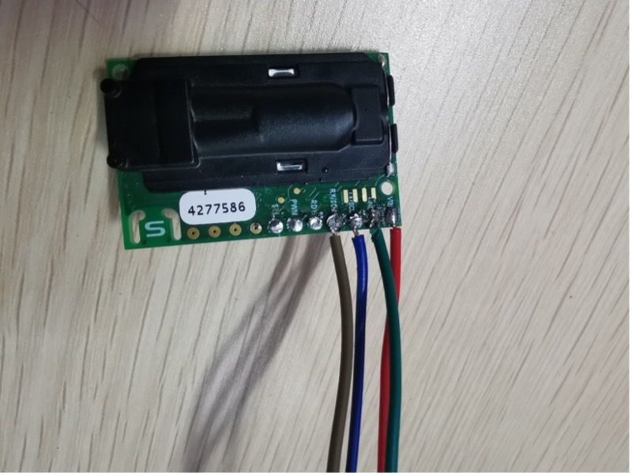

# hardware design part

## hardware requirement

- Sensirion SCD30 sensor

- raspberry pi 4B

## Install
you should first clone this to your raspberry 4B.
<pre>git clone https://github.com/CRI-Project/hardware-design.git</pre> 
Install the related packages by using 
<pre>pip install -r requirements.txt</pre>
Note: we used Python version 3.x to test this code.

